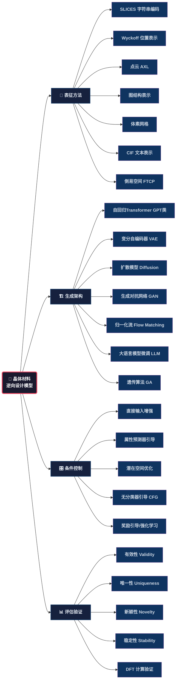
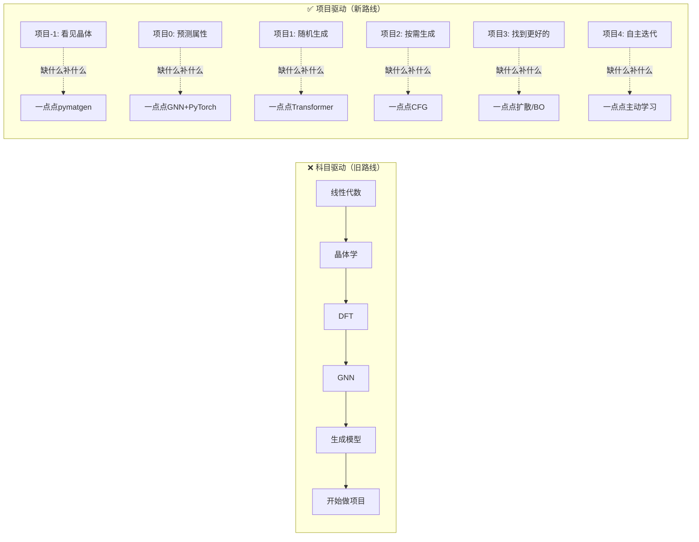
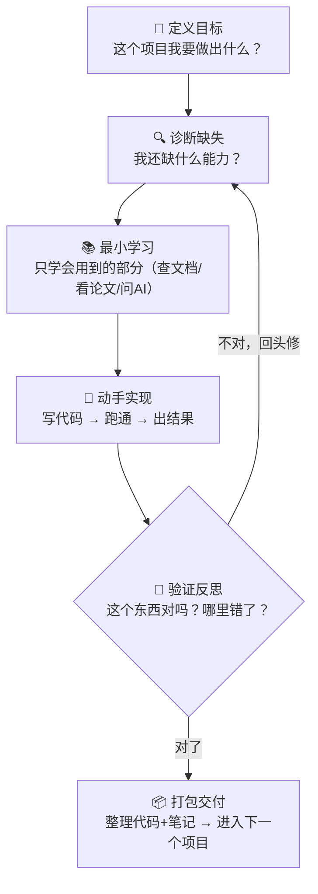
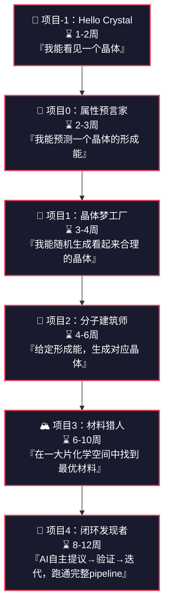
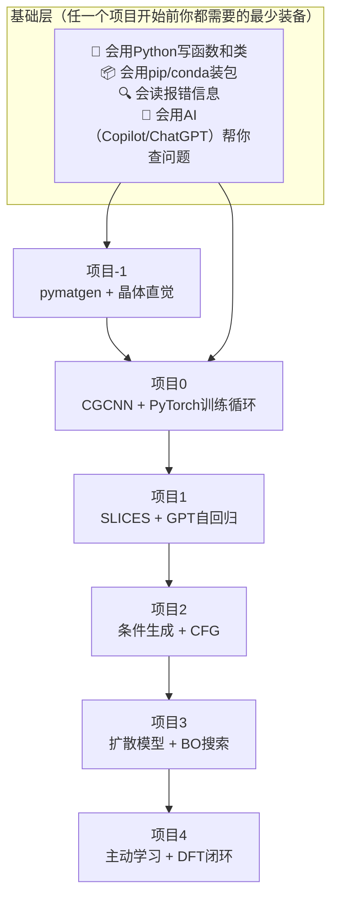
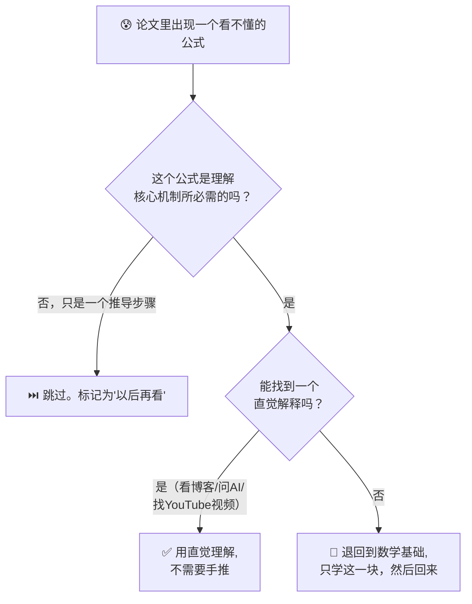
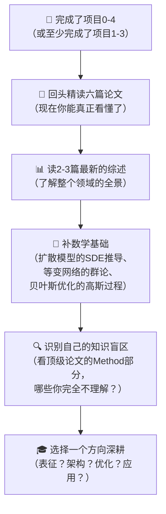
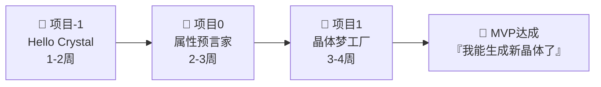

# 六篇论文模型构建方法总结与学习路线（批判性修订版）

> ⚠️ **阅读提示**：本文档经历了三次迭代：
> - **第一版**：原始的科目驱动路线（时间偏乐观、数学缺失、实践空洞）
> - **第二版**：批判性修订（补充了数学/工程/故障排查/社区资源，但仍是科目驱动）
> - **第三版（当前）**：项目驱动·第一性原理重构（不再按科目排列，而是按7个
>   递进项目组织，"用到了再学，只学够用的那部分"）
>
> 标注 🤔 的段落为对**原始路线**的批判性评论（保留以供对比），标注 ✅ 的
> 段落为修正后的建议。核心学习路线请跳至**第三节**。

---

## 零、😱 批判性审视：原路线存在哪些问题？

在开始学习之前，必须先认清这份路线图中隐藏的"坑"。以下是从学生视角发现的关键问题：

### 0.1 ⏱️ 时间估算严重偏乐观

| 原路线声称 | 现实情况 |
|------------|----------|
| 第一阶段 2-4 周学完 PyTorch + 晶体学 + DFT + 数据库 + pymatgen/ase | 230个空间群的理解就需要数周；PyTorch从零到能自定义Dataset/训练循环至少 **6-8周** |
| 第三阶段 6-8 周学 Transformer + GPT + VAE + 扩散模型 + 归一化流 | 这5个方向每个都是独立研究领域，精通一个都需数月。8周只能走马观花，无法真正理解 |
| 总计 22-34 周（约5.5-8.5个月）完成从零到专家 | 全职投入的情况下，扎实完成至少需要 **12-18个月**；业余学习则需 **18-24个月** |

✅ **修正**：每个阶段的时间估算已在下方翻倍调整。请做好"这是一场马拉松，不是短跑"的心理准备。

### 0.2 📐 数学基础完全缺失——这是最致命的漏洞

路线中**完全没有提到数学前置知识**，但这些模型的底层严重依赖数学：

- **线性代数**：晶格矩阵、分数坐标变换、Self-Attention的QKV投影、SVD/PCA降维
- **概率论与统计**：VAE的变分推断（ELBO推导）、扩散模型的Score Matching、贝叶斯优化的高斯过程
- **群论基础**：空间群对称性、Wyckoff位置实际上是群论概念，不懂群论就无法理解对称性约束
- **微分几何入门**：Flow Matching（FlowMM）在黎曼流形上的操作
- **随机微分方程入门**：扩散模型的反向SDE推导（Score-based SDE框架）
- **最优化理论**：梯度下降的收敛性、Adam/AdamW的原理、拉格朗日对偶

✅ **修正**：已在下方新增**第零阶段：数学与编程基础**，这是不可跳过的前置阶段。

### 0.3 🔗 阶段间依赖关系混乱

- 原路线第二阶段学GNN（ALIGNN），但第一阶段只安排了"PyTorch基础"——GNN的消息传递需要扎实的深度学习功底
- 原路线第三阶段同时学VAE和扩散模型——扩散模型（DDPM）的数学依赖于对VAE的理解，应先VAE后扩散
- 遗传算法被放在第四阶段，但第二阶段论文就涉及GA——概念出现顺序与学习顺序脱节

✅ **修正**：已重新排列学习顺序，添加了明确的先修依赖标注。

### 0.4 🏗️ 实践指导空洞，缺乏可操作步骤

- "用pymatgen读取CIF→转SLICES→转Wyckoff→可视化"——Wyckoff转换不是简单API调用，涉及空间群自动识别、Wyckoff多重性匹配，实际代码量很大
- "复现MatterGPT在Alex-20小数据集上训练"——Alex-20有 **280,033个结构**，根本不算"小数据集"，单张4090训练也需数天到一周
- 没有提供数据处理pipeline的具体设计（数据清洗策略、增强方法、train/val/test划分原则）

✅ **修正**：每个阶段添加了具体的可检查里程碑和最小可运行代码目标。

### 0.5 🧪 缺少实验管理、版本控制与工程实践

完全没有提到：Git版本控制、实验追踪（wandb/TensorBoard）、超参数调优（Optuna）、模型checkpoint管理、混合精度训练（AMP）、分布式训练基础。这些在真实研究中至关重要，缺失意味着大量时间浪费和实验无法复现。

✅ **修正**：已在第四阶段新增"工程实践"模块。

### 0.6 ⚠️ 缺少失败案例与常见陷阱

晶体生成领域的典型失败模式完全缺失：
- **SLICES解码失败率高达30-50%**：生成的字符串常无法还原为有效晶体结构
- **模式坍塌**：GAN/VAE生成的结构高度重复、缺乏多样性
- **曝光偏差（Exposure Bias）**：自回归模型训练用teacher forcing，推理用自回归采样，分布不一致导致生成质量骤降
- **物理无效性**：原子重叠（距离<1Å）、不合理键长、价态不平衡
- **GPU显存溢出**：晶体批处理时原子数不一致导致padding浪费或OOM
- **DFT计算失败**：VASP计算不收敛、结构优化跑飞

✅ **修正**：已在各阶段添加"常见踩坑"提示，并在第五阶段新增完整的故障排查指南。

### 0.7 📊 评估体系不完整

只列了有效性/唯一性/新颖性/稳定性，但缺少：
- **生成多样性**（FCD、覆盖率）——判断模型是否坍塌的关键指标
- **条件一致性**（生成的属性是否匹配目标条件，MAE/RMSE）
- **各指标间的权衡与冲突**（高有效性常以低新颖性为代价）
- **计算效率**（每秒生成结构数、推理延迟）——决定模型能否实际使用

### 0.8 🔧 MVP方案过于简化，有误导性

- "minGPT仅约300行代码"——这是教学玩具代码，缺少分布式训练、混合精度、梯度累积等生产必需特性
- MatterGPT GitHub仓库可能依赖过时、API不兼容
- SLICES包与PyTorch版本的兼容性需要额外处理

### 0.9 🌐 缺少领域社区和前沿追踪指引

- 未推荐关键学术会议（NeurIPS/ICML/ICLR的AI4Science Workshop、MRS Fall/Spring）
- 未推荐活跃研究组（MIT CGCNN组、Microsoft MatterGen组、FAIR Open Catalyst等）
- 未推荐中文资源（中国材料学会、国内相关课题组）

---

## 一、主要方法全景概览

这六篇论文涵盖了当前晶体材料逆向设计领域的主流方法体系，可归纳为以下几条技术路线：



---

## 二、各论文核心方法拆解

### 1. MatterGPT（陈燕等）
| 维度 | 具体方法 |
|------|----------|
| **表征** | SLICES（简化的线性输入晶体编码系统）：原子符号 + 节点索引(0-19) + 边标签(27种3字符组合，如 `+++`, `o+o`)，共132个token |
| **架构** | GPT-style 自回归仅解码器 Transformer（12层、12头、嵌入维度768、~80M参数） |
| **训练** | 因果语言建模（CLM），预测下一个token；AdamW优化器，lr=0.0001，batch=60，50 epochs |
| **条件生成** | 属性嵌入（形成能/带隙）与切片嵌入拼接 + 类型嵌入区分 + 可训练位置嵌入 |
| **采样** | Gumbel-Softmax (T=1.2) + Top-p采样 (p=0.9) |
| **验证** | DFT (VASP) 计算形成能和带隙，MAPE评估 |
| **数据** | Alex-20数据集（280,033个结构，每个晶胞≤20原子） |

### 2. 组合遗传算法（Atilgan & Hu）
| 维度 | 具体方法 |
|------|----------|
| **表征** | 二进制向量（每个位代表一个可能的掺杂位置，1=被掺杂） |
| **搜索策略** | 遗传算法：种群40，10代，精英概率0.1，锦标赛选择(size=3)，交叉概率0.9，变异概率0.1 |
| **三种变体** | GA-basic（随机替换）、GA-SS（统计相似性采样）、GA-SC（统计交叉） |
| **适应度** | VASP DFT计算的自由电子能量 |
| **效率** | 仅需400/1365次DFT计算，节省70%计算资源 |

### 3. ALIGNN-CSP（程龙秦等）
| 维度 | 具体方法 |
|------|----------|
| **表征** | 晶体图（原子节点 + 键边 + **键角信息**）→ ALIGNN图神经网络 |
| **迁移学习** | 先在OQMD大DFT数据集（102万结构）预训练 → 冻结除最后两层外的所有层 → 用实验数据（2562条）微调 |
| **可合成性** | PUML（正样本+未标记学习）：100个ALIGNN分类器集成，迭代训练，平均精度87.1% |
| **优化算法** | 贝叶斯优化（BO）优于RS、PSO、GA |
| **对称性约束** | 空间群 + Wyckoff位置约束搜索空间 |
| **适应度** | FV = a(1-Psyn) + (1-a)sigmoid(ΔHf) |

### 4. 晶体结构生成式AI综述（De Breuck等）
提出四大支柱分类体系：
- **表征**：体素网格 / 点云(AXL) / 图 / Wyckoff位置 / 倒易空间 / CIF
- **架构**：VAE / GAN / Transformer / 归一化流 / 扩散模型 / LLM微调
- **条件化**：直接输入增强(1) / 条件潜在先验(2) / 属性预测潜在优化(3) / 奖励引导(4) / 约束数据训练(5)
- **材料域**：氧化物/钙钛矿/合金等

### 5. 无机化合物逆向设计综述（Kneiding等）
覆盖四类材料体系：
- **过渡金属配合物(TMC)**：字符串(SMILES/SELFIES) + VAE/GAN/GA/DM
- **非多孔晶体**：图/点云 + 扩散/VAE/GAN/LLM
- **MOFs**：模块化构建单元 + GA
- **沸石**：拓扑代码 + 模板导向

### 6. 闭环工作流综述（Babu等）
核心框架：
- **提案→评估→反馈** 循环
- **多模态学习**：结构 + 成分 + 文本 + 显微图像 + 物理信号
- **五阶段管道**：候选生成 → 低成本筛选 → 替代评分 → 选择性高保真验证 → 反馈更新
- **搜索策略**：潜在GD / 引导扩散(CFG) / 贝叶斯优化(BO) / 强化学习(RL) / 主动学习(AL)

---

## 三、学习路线图（项目驱动版 · 第一性原理）

> 🤔 **原路线问题（第三次审视）**：即使修订后添加了第零阶段、翻倍了时间、补了数学
> 基础，这仍然是**"科目驱动"**的模式——先学A再学B再学C，学完才开始做。现实
> 中没人这么学习，大脑也不是这样工作的。真正的学习是：**先想做一个东西，做的
> 过程中卡住了，回头补需要的那一小块知识，然后继续做。**
>
> ✅ **彻底重构**：不再有"第零阶段学数学→第一阶段学晶体学→第二阶段学GNN"。
> 取而代之的是 **7个递进项目**，每个项目是一个可交付的东西。你需要什么知识，
> 项目会告诉你去学——**用到了再学，只学够用的那部分**。

---

### 3.0 为什么是项目驱动？



### 3.1 核心循环（每个项目都按这个来）



### 3.2 七个项目：从零到闭环



> ⚠️ **总时间：24-37周（约6-9个月全职）**。比旧路线短，因为不提前囤积知识，
> 每个项目只学当下必需的内容。但每个项目的"最小学习"部分需要你主动去查、
> 去问、去试——**没有人为你把知识点喂到嘴边。**

---

### 🔬 项目-1：Hello Crystal — "我能看见一个晶体"

| 维度 | 内容 |
|------|------|
| **🎯 目标** | 读取一个CIF文件，把原子坐标打印成表格，画出3D结构图，手动移动一个原子看结构是否还合理 |
| **📐 第一性原理** | 晶体 = 晶格(Lattice) + 原子类型(Species) + 分数坐标(Frac Coords)。其他一切（对称性、空间群、Wyckoff位置）都是这三个基础量的衍生概念 |
| **📚 最小学习（用到什么学什么）** | `pymatgen.Structure.from_file()` → `structure.lattice` / `.species` / `.frac_coords` → `matplotlib` 3D散点图 → 理解"分数坐标×晶格矩阵=笛卡尔坐标" |
| **🔧 需要装的库** | `pymatgen`, `matplotlib`, `numpy` |
| **🎁 交付物** | 一个Python脚本，输入为CIF文件路径，输出为：① 原子坐标表格（Species \| a \| b \| c）② 3D结构图（不同元素用不同颜色）③ 最近邻距离统计 |
| **⏱️ 预估** | 1-2周 |
| **⚠️ 坑** | 不要一上来就搞230个空间群。这个项目的唯一目的是**建立对"晶体是一个数学对象"的直觉**。分数坐标在[0,1)区间内，超出这个范围要fold回来——这是周期性边界条件的本质 |
| **🧮 涉及的数学（最小集）** | 矩阵乘法（晶格矩阵×分数坐标=笛卡尔坐标）；3D欧氏距离公式 |

---

### 🔮 项目0：属性预言家 — "我能预测一个晶体的形成能"

| 维度 | 内容 |
|------|------|
| **🎯 目标** | 输入一个晶体结构 → 输出形成能（或带隙）。不需要自己做DFT，用现成的Materials Project数据训练一个小型神经网络 |
| **📐 第一性原理** | 结构决定性质。晶体结构蕴含了所有关于原子间相互作用的信息，模型的任务是从结构中"读出"这些信息。图是最自然的晶体表示（原子=节点，化学键=边） |
| **📚 最小学习（用到什么学什么）** | Crystal Graph（怎么从`pymatgen.Structure`构建图：节点特征=原子类型one-hot，边=最近邻连接）→ 消息传递的直觉（不是公式！理解"每个节点从邻居收集信息，更新自己"即可）→ PyTorch `DataLoader` + 训练循环 → MAE/Loss的含义 |
| **🔧 需要装的库** | `pymatgen`, `torch`, `torch_geometric`（或`dgl`）, `wandb` |
| **🎁 交付物** | 一个CGCNN的训练+评估脚本。在MP形成能数据（~1000条，只选氧化物）上，MAE < 0.3 eV/atom |
| **⏱️ 预估** | 2-3周 |
| **⚠️ 坑** | ① 不要一上来就用全量MP数据（10万+），从氧化物子集开始。② 别被"消息传递"的公式吓到——核心就是：邻居特征→线性变换→聚合(求和/平均)→更新自身，就这么简单。③ 形成能是**广延量**，需要除以原子数变成每个原子的值才能公平比较 |
| **🧮 涉及的数学（最小集）** | 梯度下降的直觉（沿最陡方向下山）；均方误差MSE |
| **🧠 需要理解的论文** | CGCNN (Xie & Grossman, 2018) — 只读第2-3节（图构建+模型架构），跳过所有消融实验 |

---

### 🎲 项目1：晶体梦工厂 — "我能随机生成看起来合理的晶体"

| 维度 | 内容 |
|------|------|
| **🎯 目标** | 训练一个模型，能随机生成晶体结构（不需要指定属性）。生成的结构要能通过基本的物理合理性检查（原子不重叠、键长合理、电荷中性） |
| **📐 第一性原理** | 晶体结构存在于一个**高维流形**上——不是任意的原子排列都能成为晶体。生成模型的任务是学习这个流形，然后从中采样。**表征是核心**：你必须先把连续的三维晶体"压缩"成离散的token序列或连续向量，才能用生成模型处理 |
| **📚 最小学习（用到什么学什么）** | SLICES表征（为什么选它？它是132个token的离散序列，天然适配GPT）→ 自回归生成（"给定前N个token，预测第N+1个"这就是GPT做的全部事情）→ Transformer Decoder（不看Encoder，只听Decoder：因果掩码、多头注意力、位置编码）→ 采样的温度/top-p参数的含义 |
| **🔧 需要装的库** | `slices`, `pymatgen`, `torch`, `wandb` |
| **🎁 交付物** | 一个SLICES+GPT模型。训练在Alex-20的1万条子集上（不要全量！）。无条件生成1000个结构，解码成功率>50%，物理合理性通过率>30% |
| **⏱️ 预估** | 3-4周 |
| **⚠️ 坑** | ① SLICES解码有30-50%的失败率，这是正常的——不是你的代码有bug。② 先只在100个极小子集上过拟合（loss到0），验证pipeline没bug后再用1万条。③ **Exposure Bias（曝光偏差）**：训练时模型看到的是正确答案的下一个token，但推理时看到的是自己生成的token——如果它生成了错token，就会越错越远。这就是为什么生成质量往往不如训练loss暗示的那么好 |
| **🧮 涉及的数学（最小集）** | Softmax函数；交叉熵损失；Gumbel-Softmax的直觉（让离散采样可导） |
| **🧠 需要理解的论文** | SLICES (Xiao et al., 2023) 编码/解码部分；MatterGPT架构部分；nanoGPT源码（理解Training loop） |

---

### 🎯 项目2：分子建筑师 — "给定形成能，生成对应晶体"

| 维度 | 内容 |
|------|------|
| **🎯 目标** | 在项目1的生成模型上添加条件控制：输入"形成能=-2.5 eV/atom"→生成具有该形成能的晶体结构。验证条件一致性（生成的结构→用项目0的预测器回测→MAE<0.3 eV/atom） |
| **📐 第一性原理** | 条件生成 ≠ "生成+筛选"。生成模型需要学习**条件概率P(结构\|属性)**，而不仅仅是P(结构)。核心思想：把属性编码成一个向量，注入到生成过程的每一步，让模型"知道"该往哪个方向生成。**CFG（无分类器引导）**的本质是：`生成方向 = 无条件方向 + w×(有条件方向 - 无条件方向)`，w越大越听条件的话，但w太大模式会坍塌 |
| **📚 最小学习（用到什么学什么）** | 属性嵌入（怎么把标量"形成能=-2.5"变成一个向量拼到token embedding后面）→ CFG的数学原理（只需要理解上面那个线性插值公式）→ CFG强度w的调参（w=1是无条件，w=3-5是常用范围，w>10开始坍塌） |
| **🔧 需要装的库** | 项目1的全部 + 可能需要`matbench`取标准化数据 |
| **🎁 交付物** | 项目1模型的条件版本。给定目标形成能，生成100个结构→用项目0的CGCNN回测→MAE<0.3 eV/atom（这是相对宽松但可达的目标） |
| **⏱️ 预估** | 4-6周 |
| **⚠️ 坑** | ① **属性预测器的精度是条件生成的瓶颈**——如果项目0的CGCNN MAE=0.5 eV，那你生成的MAE不可能低于0.5 eV。先升级预测器！② CFG引导强度w是一把双刃剑：w大→属性贴合好但多样性差；w小→多样性好但属性不贴合。你需要画一个w vs MAE vs 多样性的图来找最佳点 |
| **🧮 涉及的数学（最小集）** | 条件概率P(A\|B)的直觉；线性插值 |
| **🧠 需要理解的论文** | Classifier-Free Guidance (Ho & Salimans, 2022) — 只看第3节（CFG的公式和直觉），不需要看扩散模型的部分 |

---

### 🏔️ 项目3：材料猎人 — "在一大片化学空间中搜索最优材料"

| 维度 | 内容 |
|------|------|
| **🎯 目标** | 在给定的化学元素空间（如"所有含Li的氧化物"）中，找到形成能最低（最稳定）的前10个候选晶体。用生成模型提出候选+ML势能做快速筛选+至少挑3-5个做DFT验证 |
| **📐 第一性原理** | 材料发现的本质是**搜索**——在一个巨大、崎岖、大部分是无效结构的高维空间中找一个最优解。生成模型负责"提出合理的候选"，快速筛选器（ML势能）负责"过滤明显不好的"，DFT负责"最终确认"。三者各司其职。**贝叶斯优化**的直觉：已有几个点的评估结果→拟合一个高斯过程（"不确定曲线"）→在"最有希望但也最不确定"的地方采样下一个点 |
| **📚 最小学习（用到什么学什么）** | 扩散模型的直觉（不是全部数学！理解"前向加噪声，反向去噪声"即可）→ M3GNet/MACE做快速弛豫（替代DFT，获得结构能量的近似值）→ 贝叶斯优化的基本用法（`BoTorch`或`Ax`的API调用）→ Ehull（凸包距离）的含义和计算方法 |
| **🔧 需要装的库** | `matgl`（M3GNet）或 `mace`，`botorch`或`ax`，项目1的全部 |
| **🎁 交付物** | 一个搜索pipeline：① 定义化学空间（如Li-Fe-O三元系）② 生成1000个候选 → M3GNet筛选到50个 → DFT验证5个 → 报告最优结构的形成能和Ehull。如果能找到一个Ehull<0.1 eV/atom的未知结构（不在训练集中），这是可以写论文的结果 |
| **⏱️ 预估** | 6-10周 |
| **⚠️ 坑** | ① 扩散模型不是必需的——如果你在项目1/2的GPT模型上做得很好，继续用GPT+更多的优化策略（如BO筛选）也能完成这个项目。② M3GNet/MACE很快但不如DFT准，尤其是对不常见的元素组合。它的作用是**筛掉明显差的**，而不是**选出最好的**。③ Ehull>0意味着该结构在热力学上不稳定（会分解为其他相），但Ehull<0.1 eV/atom是"可能亚稳态"的范围 |
| **🧮 涉及的数学（最小集）** | 高斯过程的直觉（预测值+不确定性）；期望改进(EI)直觉 |
| **🧠 需要理解的论文** | M3GNet/CGCNN作为力场；Ehull计算方法（Materials Project文档） |

---

### 🔄 项目4：闭环发现者 — "AI自主提议→验证→迭代"

| 维度 | 内容 |
|------|------|
| **🎯 目标** | 构建一个完整的闭环pipeline：生成候选→ML筛选→DFT验证→结果反馈到模型→模型利用DFT反馈改进下一次生成。**这是当前材料逆向设计领域的前沿工作方式** |
| **📐 第一性原理** | 计算机（生成模型+ML势能）和实验/DFT各有分工：计算机快但不准，DFT准但慢。闭环的核心是**最小化昂贵计算的次数，同时最大化信息增益**。主动学习的选择策略就是在问："下一个要花30分钟DFT算的结构，应该选哪个，才能让我的模型进步最大？" |
| **📚 最小学习（用到什么学什么）** | 主动学习的三种选择策略：不确定性采样（选预测器最不确定的）、多样性采样（选和已有数据最不一样的）、期望改进（选最可能突破当前最优的）→ 把DFT结果注入训练数据的策略（增量训练 vs 全量重训）→ 多目标优化的基本概念（Pareto最优="不牺牲A就无法改善B"） |
| **🔧 需要装的库** | 项目3的全部 + 可能需要`atomate2`/`jobflow`管理DFT计算流 + 如果你用VASP的话`custodian`处理常见DFT报错 |
| **🎁 交付物** | 一个自动化的闭环脚本：给定化学空间和预算（如"最多100次DFT计算"），自动运行：生成→筛选→选最有价值的N个→DFT→加入训练集→更新模型→下一轮。输出：所有DFT计算过的最优3个结构 |
| **⏱️ 预估** | 8-12周 |
| **⚠️ 坑** | ① 这个项目**强烈建议作为合作项目**——和实验室里做DFT的同学合作，你负责生成模型，ta负责DFT计算和结果解读。② DFT计算经常失败（不收敛、结构跑飞），这是常态，不是你pipeline的问题。用`custodian`自动处理常见错误。③ 闭环的反馈周期很长（每轮DFT可能数小时到数天），所以需要耐心 |
| **🧮 涉及的数学（最小集）** | 信息论的直觉（信息增益）；Pareto最优 |
| **🧠 需要理解的论文** | 闭环综述（Babu等）§5.7 主动学习部分 |

---

### 3.3 各项目之间的知识依赖关系（精简版）



### 3.4 如果你不会 Python 怎么办？

在开始项目-1之前，花**最多1周**过一遍这个最小Python清单：
- 变量、列表、字典、for循环、if/else、函数定义、`import`
- `numpy`：创建数组、索引切片、`np.dot()`（矩阵乘法）
- `matplotlib`：`plt.scatter()`、`plt.show()`
- 类的基本概念（`class MyClass:`、`__init__`、`self`）

**不需要学**：装饰器、生成器、上下文管理器、元类、异步编程、`*args/**kwargs`、一切和web开发相关的东西。**用到了再查。**

### 3.5 每个项目遇到数学公式怎么办？



**核心原则**：你的目标是做出能用的模型，不是成为数学家。大部分公式你只需要理解"它做了什么"和"输入输出是什么"，不需要能手写推导。

### 3.6 项目驱动的优缺点

| 方面 | 科目驱动（旧） | 项目驱动（新） |
|------|:-----------:|:-----------:|
| **上手速度** | ❌ 慢，学了很久还不知道能做什么 | ✅ 快，第一周就做出了能看见的东西 |
| **知识系统性** | ✅ 覆盖全面 | ⚠️ 可能留下知识盲区（需要后续主动补） |
| **学习动力** | ❌ 容易迷失在理论中 | ✅ 每个项目有看得见的成果，正反馈强 |
| **知识留存率** | ❌ 学而不用容易忘 | ✅ 用了才学，不易忘 |
| **适合人群** | 喜欢先建立全景认知的人 | 喜欢动手、从实践中学习的人 |

> ⚠️ **坦白说**：项目驱动不是银弹。它可能导致你的知识有一些"洞"——比如你可能很会用CGCNN但不知道GAT和GCN的区别。这些洞需要你在完成核心项目链后，**回头读综述、看课程、补基础**来填。

---

### 3.7 完成所有项目后：如何填知识盲区



> 这个"填盲区"阶段预计需要 **8-16周**。加上这8-16周，总投入约 **32-53周（8-13个月全职）**。

> 这是**合理的**——从头开始成为一个跨学科（AI+材料）的研究者，一年的全职投入是正常的。
> 你的优势是：在第3-4周你就做出了第一个可展示的项目，后面的每一步都有积累。

---

## 四、MVP：最小可行成果链（项目驱动版）

> 🤔 **原MVP方案问题**：过于具体（只推MatterGPT），但没有解释"为什么这样走"。
> ✅ **本次重构**：MVP = 完成项目-1 + 项目0 + 项目1。这三步构成最小闭环，让你
> 在 **6-9周** 内经历完整的"看见晶体→预测属性→生成晶体"流程。

### MVP = 项目-1 → 项目0 → 项目1（6-9周）



### MVP达成标准

- [ ] 能从Materials Project拉数据，用pymatgen操作晶体结构
- [ ] 训练了一个CGCNN，能预测形成能（MAE<0.3 eV/atom）
- [ ] 训练了一个SLICES+GPT，能无条件生成晶体（解码成功率>50%）
- [ ] 用pymatgen验证了生成结构的物理合理性
- [ ] 所有代码在GitHub上，用wandb记录了实验

### MVP之后的分叉路径

完成MVP后，根据你的兴趣和资源选择深入方向：

| 方向 | 继续做 | 适合谁 |
|------|--------|--------|
| **生成质量** | 项目3（扩散模型） | 想追求SOTA生成质量 |
| **实用工具** | 项目2（条件生成） | 想做出"给定属性→给出材料"的工具 |
| **学术研究** | 项目4（闭环） | 想做可发表的研究工作 |
| **快速应用** | 项目2 + 已有DFT数据 | 想在自己的材料体系上快速出成果 |

---

## 五、关键技术选型建议（修订版）

> 🤔 **原路线问题**：部分建议存在误导——如"数据少→GA"在晶体空间效率极低；缺少等变网络这一核心范式。
> ✅ **修订说明**：重新校准了选型逻辑，新增等变网络和实际约束考量。

| 需求场景 | 推荐方法 | 理由 | ⚠️ 注意事项 |
|----------|----------|------|-------------|
| **数据极少(<100条)、快速原型** | 遗传算法 + M3GNet快速适应度 | 无需训练数据；M3GNet代替DFT加速1000倍 | GA的变异在晶体空间极易产生无效结构，需设计智能变异算子（如保持对称性的Wyckoff变异） |
| **有中等DFT数据(1K-10K)** | 等变扩散模型(DiffCSP/CDVAE) | 等变网络数据效率高，扩散模型生成质量好 | 数据量仍偏少，建议从预训练模型微调 |
| **有大量DFT数据(>100K)** | 扩散模型(MatterGen/DiffCSP) | SOTA生成质量；支持多属性联合条件 | 训练资源需求高（多卡A100），需考虑资源预算 |
| **需要文本/NL交互** | LLM微调(CrystaLLM/ChatMol) | 自然语言灵活性高 | LLM生成的物理合理性需额外后处理验证 |
| **有少量实验数据** | ALIGNN + PUML + 迁移学习 | 弥合DFT与实验差距 | PUML方法的正样本定义需领域专家参与 |
| **需要严格对称性保证** | Wyckoff + Transformer/Diffusion (CrystalFormer/WyCryst) | 结构天然满足空间群约束 | Wyckoff编码/解码的实现复杂度高 |
| **多属性帕累托权衡** | GFlowNet / 多目标BO(如qNEHVI) | 能采样帕累托前沿 | GFlowNet训练不稳定，需要仔细调参 |
| **计算资源有限（单GPU）** | SLICES + GPT (~80M参数) | 参数量小，单卡4090可训练 | 生成质量上限受限于表征和模型容量 |
| **🆕 需要等变性质保证** | e3nn/NequIP/MACE作为属性预测器 + 等变生成器 | 等变性是物理规律，不应仅靠数据学习 | 等变网络的编程复杂度远高于标准GNN |

### 选型决策树

```mermaid
flowchart TD
    Q1{是否有大量DFT数据(>50K)?} -->|是| Q2{计算资源是否充足(≥4×A100)?}
    Q1 -->|否| Q3{是否必须保证对称性?}
    Q2 -->|是| R1[MatterGen/DiffCSP<br/>等变扩散模型]
    Q2 -->|否| R2[SLICES + GPT<br/>或小规模DiffCSP]
    Q3 -->|是| R3[CrystalFormer/WyCryst<br/>Wyckoff表征+Transformer]
    Q3 -->|否| Q4{数据量?}
    Q4 -->|100-10K| R4[CDVAE/等变VAE<br/>+ 数据增强]
    Q4 -->|<100| R5[遗传算法 + M3GNet<br/>或主动学习+DFT]
```

---

## 六、🆕 常见失败模式与排查指南

> 这是原路线**完全缺失**但至关重要的内容。知道什么会出错、为什么出错、怎么修，是区分"会用工具"和"真正理解"的分水岭。

### 6.1 生成模型训练失败

| 症状 | 可能原因 | 排查步骤 |
|------|----------|----------|
| **Loss不下降** | 学习率过大/过小；数据预处理错误；模型架构bug | ①lr从1e-5到1e-3网格搜索 ②过拟合小批量(16条)验证pipeline ③检查tokenizer输出是否合法 |
| **Loss剧烈震荡** | batch size太小；lr太大；数据未shuffle | ①增大batch size或使用梯度累积 ②降低lr并启用warmup ③检查DataLoader的shuffle设置 |
| **生成全是重复结构** | 模式坍塌（常见于GAN/VAE）；采样温度太低 | ①降低CFG引导强度 ②提高采样温度 ③添加多样性正则化项 |
| **生成结构全部无效** | SLICES解码失败；表征设计有问题 | ①单独测试解码器：手工构造合法SLICES字符串→解码→是否成功 ②统计各失败类型的比例 |

### 6.2 物理有效性失败

| 症状 | 可能原因 | 排查步骤 |
|------|----------|----------|
| **原子重叠（距离<0.5Å）** | 分数坐标生成不合理；周期性边界处理错误 | ①检查坐标是否在[0,1)区间 ②验证最小镜像距离的计算 ③添加原子间距后处理惩罚 |
| **不合理的键长** | 原子类型错误搭配；配位数不合理 | ①对比ICSD中该元素对的典型键长 ②检查SMACT的价态规则是否通过 |
| **电荷不平衡** | 氧化态分配错误；元素组合违反电中性 | ①用pymatgen的`oxidation_states`自动分配 ②过滤总电荷≠0的结构 |
| **密度不合理** | 晶格参数过大或过小 | ①设置密度范围过滤器（如1-30 g/cm³）②对比Materials Project中同类材料的密度分布 |

### 6.3 DFT计算失败

| 症状 | 可能原因 | 排查步骤 |
|------|----------|----------|
| **SCF不收敛** | K点密度不足；初始结构离平衡态太远 | ①先用M3GNet/MACE弛豫得到合理初始结构 ②增加K点密度（如从Γ-centered 2×2×2到4×4×4）③调整混合参数(AMIX/BMIX) |
| **结构弛豫跑飞** | 力常数太大；初始结构不合理 | ①分步弛豫：先弛豫晶格（ISIF=3）→再弛豫原子位置（ISIF=2）②降低步长(EDIFFG=-0.02改为-0.05) |
| **形成能异常** | 元素参考态能量错误 | ①检查`MPInterstellar`中该元素的参考态 ②确保使用了与MP一致的赝势 |

### 6.4 工程实践失败

| 症状 | 可能原因 | 排查步骤 |
|------|----------|----------|
| **GPU OOM** | batch中结构原子数差异大导致padding浪费 | ①按原子数排序后bucketing ②使用`pack_padded_sequence` ③梯度累积模拟大batch |
| **训练中断无法恢复** | 没有保存checkpoint | ①每个epoch保存checkpoint ②使用wandb追踪 ③保存optimizer state和scheduler state |
| **代码跑不起来** | 依赖版本冲突 | ①使用conda隔离环境 ②`pip freeze > requirements.txt`锁定版本 ③优先用官方Docker镜像 |

---

## 七、🆕 领域社区与前沿追踪资源

> 原路线完全没有告诉学生"遇到问题去哪里问"、"前沿进展去哪里看"。

### 7.1 关键学术会议与Workshop

| 会议/Workshop | 关注重点 | 频率 |
|---------------|----------|------|
| **NeurIPS AI4Science Workshop** | AI+科学发现的顶级 workshop | 每年12月 |
| **ICML/ICLR AI4Science** | 机器学习+材料/化学/生物 | 每年 |
| **MRS Fall/Spring Meeting** | 材料研究学会年会，有计算材料专场 | 每年 |
| **APS March Meeting** | 美国物理学会，凝聚态物理+计算材料 | 每年3月 |
| **中国材料大会** | 国内最大的材料学术会议 | 每年 |

### 7.2 活跃研究组与关键GitHub仓库

| 资源 | 说明 |
|------|------|
| **Materials Project** (`materialsproject.org`) | 最大的DFT计算数据库，提供API和pymatgen |
| **FAIR Open Catalyst Project** | Meta的催化材料AI项目，含OC20/OC22数据集 |
| **MatterGen (Microsoft Research)** | 扩散模型晶体生成的SOTA |
| **MACE-MP-0** | 覆盖全周期表的通用ML势能，比DFT快百万倍 |
| **MatBench** | 材料机器学习的标准化benchmark |
| **huggingface.co** → 搜索"crystal"或"materials" | 越来越多的材料模型上传到HuggingFace |

### 7.3 中文资源推荐

| 资源 | 说明 |
|------|------|
| **中国科学技术大学《固体物理》MOOC** | 晶体学基础的中文好课 |
| **深势科技(DeePMD)** | 国产ML势能方法，中文社区活跃 |
| **Bohrium科研平台** | 提供免费GPU算力（A100）用于DFT和ML训练 |
| **知乎专栏**：搜索"AI材料""晶体生成" | 有部分高质量的技术博客 |

### 7.4 求助渠道（从快到慢排序）

1. **GitHub Issues** → 在对应仓库提issue（附完整错误日志）
2. **Stack Overflow** → 带`pymatgen` / `pytorch` / `materials-informatics`标签
3. **Materials Project Community Forum** (`matsci.org`)
4. **直接邮件联系论文作者** → 大多数研究者乐意回答真诚的技术问题
5. **Twitter/X** → 关注 `#compchem` `#AI4Science` `#materialsScience` 标签

---

## 八、🆕 推荐的每周学习节奏

> 不要试图"全职硬啃"——大脑需要消化时间。以下是推荐的学习节奏：

### 对于在校学生（可全职投入）

```
周一-周五：
  上午(3h)：理论学习（读论文/看课程/推公式）
  下午(3h)：编程实践（写代码/跑实验/调bug）
  晚上(1h)：整理笔记 + 写学习日志

周六：
  上午(2h)：回顾本周学习内容
  下午(2h)：自由探索（读一篇感兴趣的论文/尝试一个side project）

周日：完全休息（大脑的潜意识在休息时整合知识）
```

### 对于在职/业余学习

```
工作日：每天1-2小时（建议早晨，精力最好时）
  - 周一/三/五：理论学习
  - 周二/四：编程实践
周末：每天4-5小时集中攻关
```

### 阶段衔接建议

每个阶段结束后，**强制休息2-3天**。在这2-3天：
1. 回顾该阶段的笔记 → 整理成博客或markdown文档
2. 列出5个"我还不太懂的问题"
3. 跑一次完整的checkpoint测试

---

## 九、总结：三重对比

| 维度 | 原路线（第一版） | 修订版（第二版·科目驱动） | 项目驱动版（第三版·本次） |
|------|:---:|:---:|:---:|
| **学习范式** | 科目驱动 | 科目驱动+补丁 | ✅ **项目驱动·第一性原理** |
| **数学基础** | ❌ 完全缺失 | ✅ 单独的第零阶段（6-10周） | ✅ 融入每个项目的"最小学习"中 |
| **时间估算** | ❌ 22-34周 | ⚠️ 48-80周（偏长） | ✅ 24-37周核心 + 8-16周补盲区 = **32-53周** |
| **第一周产出** | ❌ 无 | ❌ 无（在学线性代数） | ✅ **一个3D晶体可视化图** |
| **学习动力** | ❌ 容易迷失 | ⚠️ 有所改善 | ✅ 每个项目有看得见的成果 |
| **知识系统性** | ⚠️ 有框架无内容 | ✅ 较系统 | ⚠️ 可能有知识盲区（需后续补） |
| **实践指导** | ❌ 空洞 | ✅ 每阶段有🎯里程碑 | ✅ 每个项目有🎁可交付的代码 |
| **失败案例** | ❌ 完全缺失 | ✅ 4大类失败模式 | ✅ 每项目含⚠️踩坑提示 |
| **工程实践** | ❌ 完全缺失 | ✅ 含Git/wandb/AMP等 | ✅ 融入项目（如项目0就用wandb） |
| **社区资源** | ❌ 完全缺失 | ✅ 会议/研究组/求助渠道 | ✅ 保持不变 |
| **核心理念** | 学完再做 | 学完再做（但学得更扎实） | **做中学**——用到了再学 |

---

## 十、最后的建议（项目驱动版）

1. **先做一个最小的东西，然后再让它变好。** 项目-1只需要1周——做出一个能显示晶体结构的脚本。这是一个看得见的东西，它能给你继续下去的信心。

2. **不要提前囤积知识。** 如果你在项目-1阶段就开始读《固体物理学》全书，你会迷失。只读你需要的那一页——pymatgen的`Structure`类文档+分数坐标的定义。其他的，等用到了再说。

3. **用AI辅助学习。** 遇到不懂的公式、报错、概念，先问Copilot/ChatGPT。但不要全信——AI会犯错。把它的回答当成"线索"，然后去官方文档或论文里验证。

4. **记录你的"坑"。** 每完成一个项目，写半页笔记：我在哪里卡住了？怎么解决的？下次遇到类似问题怎么办？这些笔记比你读的任何教材都宝贵。

5. **如果你卡住了超过2天**，说明你的"最小学习"不够小。退一步，问自己：我需要的到底是什么？是数学基础？是一个API的用法？还是对某个概念的直觉？然后只去学那一个东西。

6. **完成MVP（项目-1+0+1）后，停下来评估。** 你有两个选择：继续做项目2-4，深入这个领域；或者你已经学到了你要的东西（可能是晶体表征、GNN、生成模型），把它们应用到另一个问题上。两条路都有价值。

7. **从失败中学。** 这个领域的大多数"成功"模型背后都有几十个失败的实验。记录每次失败的原因，它们是你最宝贵的学习资产。

---

*修订日期：2026年7月31日*  
*如需对某个具体方法（SLICES编码、ALIGNN图网络、扩散模型数学推导等）做更深入的分析，请随时提问！*
