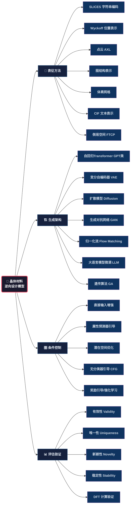
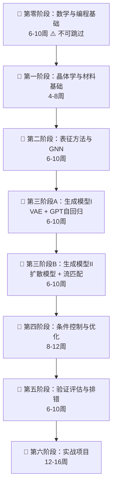

# 六篇论文模型构建方法总结与学习路线（批判性修订版）

> ⚠️ **阅读提示**：本文档在原始学习路线基础上，从一名学生的视角进行了批判性审视和修订。标注 🤔 的段落为批判性评论，标注 ✅ 的段落为修正后的建议。

---

## 零、😱 批判性审视：原路线存在哪些问题？

在开始学习之前，必须先认清这份路线图中隐藏的"坑"。以下是从学生视角发现的关键问题：

### 0.1 ⏱️ 时间估算严重偏乐观

| 原路线声称 | 现实情况 |
|------------|----------|
| 第一阶段 2-4 周学完 PyTorch + 晶体学 + DFT + 数据库 + pymatgen/ase | 230个空间群的理解就需要数周；PyTorch从零到能自定义Dataset/训练循环至少 **6-8周** |
| 第三阶段 6-8 周学 Transformer + GPT + VAE + 扩散模型 + 归一化流 | 这5个方向每个都是独立研究领域，精通一个都需数月。8周只能走马观花，无法真正理解 |
| 总计 22-34 周（约5.5-8.5个月）完成从零到专家 | 全职投入的情况下，扎实完成至少需要 **12-18个月**；业余学习则需 **18-24个月** |

✅ **修正**：每个阶段的时间估算已在下方翻倍调整。请做好"这是一场马拉松，不是短跑"的心理准备。

### 0.2 📐 数学基础完全缺失——这是最致命的漏洞

路线中**完全没有提到数学前置知识**，但这些模型的底层严重依赖数学：

- **线性代数**：晶格矩阵、分数坐标变换、Self-Attention的QKV投影、SVD/PCA降维
- **概率论与统计**：VAE的变分推断（ELBO推导）、扩散模型的Score Matching、贝叶斯优化的高斯过程
- **群论基础**：空间群对称性、Wyckoff位置实际上是群论概念，不懂群论就无法理解对称性约束
- **微分几何入门**：Flow Matching（FlowMM）在黎曼流形上的操作
- **随机微分方程入门**：扩散模型的反向SDE推导（Score-based SDE框架）
- **最优化理论**：梯度下降的收敛性、Adam/AdamW的原理、拉格朗日对偶

✅ **修正**：已在下方新增**第零阶段：数学与编程基础**，这是不可跳过的前置阶段。

### 0.3 🔗 阶段间依赖关系混乱

- 原路线第二阶段学GNN（ALIGNN），但第一阶段只安排了"PyTorch基础"——GNN的消息传递需要扎实的深度学习功底
- 原路线第三阶段同时学VAE和扩散模型——扩散模型（DDPM）的数学依赖于对VAE的理解，应先VAE后扩散
- 遗传算法被放在第四阶段，但第二阶段论文就涉及GA——概念出现顺序与学习顺序脱节

✅ **修正**：已重新排列学习顺序，添加了明确的先修依赖标注。

### 0.4 🏗️ 实践指导空洞，缺乏可操作步骤

- "用pymatgen读取CIF→转SLICES→转Wyckoff→可视化"——Wyckoff转换不是简单API调用，涉及空间群自动识别、Wyckoff多重性匹配，实际代码量很大
- "复现MatterGPT在Alex-20小数据集上训练"——Alex-20有 **280,033个结构**，根本不算"小数据集"，单张4090训练也需数天到一周
- 没有提供数据处理pipeline的具体设计（数据清洗策略、增强方法、train/val/test划分原则）

✅ **修正**：每个阶段添加了具体的可检查里程碑和最小可运行代码目标。

### 0.5 🧪 缺少实验管理、版本控制与工程实践

完全没有提到：Git版本控制、实验追踪（wandb/TensorBoard）、超参数调优（Optuna）、模型checkpoint管理、混合精度训练（AMP）、分布式训练基础。这些在真实研究中至关重要，缺失意味着大量时间浪费和实验无法复现。

✅ **修正**：已在第四阶段新增"工程实践"模块。

### 0.6 ⚠️ 缺少失败案例与常见陷阱

晶体生成领域的典型失败模式完全缺失：
- **SLICES解码失败率高达30-50%**：生成的字符串常无法还原为有效晶体结构
- **模式坍塌**：GAN/VAE生成的结构高度重复、缺乏多样性
- **曝光偏差（Exposure Bias）**：自回归模型训练用teacher forcing，推理用自回归采样，分布不一致导致生成质量骤降
- **物理无效性**：原子重叠（距离<1Å）、不合理键长、价态不平衡
- **GPU显存溢出**：晶体批处理时原子数不一致导致padding浪费或OOM
- **DFT计算失败**：VASP计算不收敛、结构优化跑飞

✅ **修正**：已在各阶段添加"常见踩坑"提示，并在第五阶段新增完整的故障排查指南。

### 0.7 📊 评估体系不完整

只列了有效性/唯一性/新颖性/稳定性，但缺少：
- **生成多样性**（FCD、覆盖率）——判断模型是否坍塌的关键指标
- **条件一致性**（生成的属性是否匹配目标条件，MAE/RMSE）
- **各指标间的权衡与冲突**（高有效性常以低新颖性为代价）
- **计算效率**（每秒生成结构数、推理延迟）——决定模型能否实际使用

### 0.8 🔧 MVP方案过于简化，有误导性

- "minGPT仅约300行代码"——这是教学玩具代码，缺少分布式训练、混合精度、梯度累积等生产必需特性
- MatterGPT GitHub仓库可能依赖过时、API不兼容
- SLICES包与PyTorch版本的兼容性需要额外处理

### 0.9 🌐 缺少领域社区和前沿追踪指引

- 未推荐关键学术会议（NeurIPS/ICML/ICLR的AI4Science Workshop、MRS Fall/Spring）
- 未推荐活跃研究组（MIT CGCNN组、Microsoft MatterGen组、FAIR Open Catalyst等）
- 未推荐中文资源（中国材料学会、国内相关课题组）

---

## 一、主要方法全景概览

这六篇论文涵盖了当前晶体材料逆向设计领域的主流方法体系，可归纳为以下几条技术路线：



---

## 二、各论文核心方法拆解

### 1. MatterGPT（陈燕等）
| 维度 | 具体方法 |
|------|----------|
| **表征** | SLICES（简化的线性输入晶体编码系统）：原子符号 + 节点索引(0-19) + 边标签(27种3字符组合，如 `+++`, `o+o`)，共132个token |
| **架构** | GPT-style 自回归仅解码器 Transformer（12层、12头、嵌入维度768、~80M参数） |
| **训练** | 因果语言建模（CLM），预测下一个token；AdamW优化器，lr=0.0001，batch=60，50 epochs |
| **条件生成** | 属性嵌入（形成能/带隙）与切片嵌入拼接 + 类型嵌入区分 + 可训练位置嵌入 |
| **采样** | Gumbel-Softmax (T=1.2) + Top-p采样 (p=0.9) |
| **验证** | DFT (VASP) 计算形成能和带隙，MAPE评估 |
| **数据** | Alex-20数据集（280,033个结构，每个晶胞≤20原子） |

### 2. 组合遗传算法（Atilgan & Hu）
| 维度 | 具体方法 |
|------|----------|
| **表征** | 二进制向量（每个位代表一个可能的掺杂位置，1=被掺杂） |
| **搜索策略** | 遗传算法：种群40，10代，精英概率0.1，锦标赛选择(size=3)，交叉概率0.9，变异概率0.1 |
| **三种变体** | GA-basic（随机替换）、GA-SS（统计相似性采样）、GA-SC（统计交叉） |
| **适应度** | VASP DFT计算的自由电子能量 |
| **效率** | 仅需400/1365次DFT计算，节省70%计算资源 |

### 3. ALIGNN-CSP（程龙秦等）
| 维度 | 具体方法 |
|------|----------|
| **表征** | 晶体图（原子节点 + 键边 + **键角信息**）→ ALIGNN图神经网络 |
| **迁移学习** | 先在OQMD大DFT数据集（102万结构）预训练 → 冻结除最后两层外的所有层 → 用实验数据（2562条）微调 |
| **可合成性** | PUML（正样本+未标记学习）：100个ALIGNN分类器集成，迭代训练，平均精度87.1% |
| **优化算法** | 贝叶斯优化（BO）优于RS、PSO、GA |
| **对称性约束** | 空间群 + Wyckoff位置约束搜索空间 |
| **适应度** | FV = a(1-Psyn) + (1-a)sigmoid(ΔHf) |

### 4. 晶体结构生成式AI综述（De Breuck等）
提出四大支柱分类体系：
- **表征**：体素网格 / 点云(AXL) / 图 / Wyckoff位置 / 倒易空间 / CIF
- **架构**：VAE / GAN / Transformer / 归一化流 / 扩散模型 / LLM微调
- **条件化**：直接输入增强(1) / 条件潜在先验(2) / 属性预测潜在优化(3) / 奖励引导(4) / 约束数据训练(5)
- **材料域**：氧化物/钙钛矿/合金等

### 5. 无机化合物逆向设计综述（Kneiding等）
覆盖四类材料体系：
- **过渡金属配合物(TMC)**：字符串(SMILES/SELFIES) + VAE/GAN/GA/DM
- **非多孔晶体**：图/点云 + 扩散/VAE/GAN/LLM
- **MOFs**：模块化构建单元 + GA
- **沸石**：拓扑代码 + 模板导向

### 6. 闭环工作流综述（Babu等）
核心框架：
- **提案→评估→反馈** 循环
- **多模态学习**：结构 + 成分 + 文本 + 显微图像 + 物理信号
- **五阶段管道**：候选生成 → 低成本筛选 → 替代评分 → 选择性高保真验证 → 反馈更新
- **搜索策略**：潜在GD / 引导扩散(CFG) / 贝叶斯优化(BO) / 强化学习(RL) / 主动学习(AL)

---

## 三、学习路线图（修订版）

> 🤔 **原路线问题**：缺少数学前置、时间估算偏乐观50-100%、阶段间依赖混乱、缺少工程实践。
> ✅ **修订说明**：新增第零阶段、所有时间翻倍调整、添加先修依赖标注(📌)、添加常见踩坑提示(⚠️)、添加可检查里程碑(🎯)。



### 🧮 第零阶段：数学与编程基础（6-10周）⚠️ 不可跳过

> 这是原路线**完全缺失**的阶段。跳过此阶段直接进入后续学习，会导致面对论文公式完全看不懂、只能复制代码而无法调试修改。

| 模块 | 最低要求 | 达到标准 | 推荐资源 |
|------|----------|----------|----------|
| **线性代数** | 矩阵乘法、特征值分解、SVD、张量运算 | 能手推Attention的QKV矩阵运算 | 3Blue1Brown《线性代数的本质》+ Gilbert Strang MIT 18.06 |
| **概率论** | 条件概率、贝叶斯公式、高斯分布、KL散度 | 能推导VAE的ELBO损失函数 | 《概率导论》(Bertsekas) 第1-5章 |
| **微积分与优化** | 链式法则、梯度下降、Adam原理、拉格朗日乘子 | 能手写反向传播；能解释AdamW为何优于Adam | 《深度学习》(Goodfellow) 第4章 + 第8章 |
| **群论入门** | 群的定义、子群、陪集、商群的基本概念 | 理解"空间群=点群+平移群(半直积)"的含义 | Zee《Group Theory in a Nutshell》第I-II部分 |
| **Python进阶** | NumPy向量化、类继承、`__getitem__`、装饰器 | 能自定义PyTorch Dataset和DataLoader | 《Fluent Python》(Ramalho) 选读 |
| **PyTorch实战** | `nn.Module`、`autograd`、`DataLoader`、GPU训练 | 独立完成一个图像分类任务（如CIFAR-10） | PyTorch官方60分钟教程 + d2l.ai |

🎯 **阶段检查点**：独立用PyTorch实现一个MLP分类器 → 实现一个CNN → 实现自定义Dataset类 → 写出VAE的ELBO推导 → 解释空间群符号（如Pm-3m、Fm-3m）的含义。

### 🥇 第一阶段：晶体学与材料基础（4-8周）

> 📌 **先修依赖**：第零阶段完成。  
> ⚠️ **常见踩坑**：不要把DFT当成"理解即可"——至少需要手动运行一个简单计算，否则后面无法判断生成结构的合理性。  
> ⚠️ **常见踩坑**：230个空间群不必全部记忆，但必须理解 Hermann-Mauguin 符号的命名逻辑和至少掌握前20个常见空间群。

| 模块 | 内容 | 达到标准 | 参考资源 |
|------|------|----------|----------|
| **Python深度学习巩固** | 自定义训练循环、学习率调度、梯度裁剪、混合精度训练(AMP) | 能写出一个生产级训练脚本（含checkpoint恢复） | PyTorch官方教程 + d2l.ai |
| **晶体学核心** | 晶格参数(a,b,c,α,β,γ)、7大晶系、14种Bravais晶格、空间群符号解读、Wyckoff位置与多重性 | 能看懂CIF文件每一行；能手动画出NaCl的晶胞（空间群Fm-3m） | 《固体物理学》(Kittel) + Bilbao Crystallographic Server |
| **DFT实操入门** | 形成能公式、凸包图(Convex Hull)解读、声子谱的含义、K点与截断能的含义 | 用pymatgen调用VASP（或免费替代Quantum ESPRESSO）完成一个简单晶体的结构弛豫 | Materials Project文档 + pymatgen官方tutorial |
| **材料数据库操作** | MP API查询、OQMD数据格式、Alexandria/ICSD的获取方式 | 用pymatgen的MPRester拉取100个结构并导出为CIF | pymatgen官方文档 + Materials Project API |
| **核心工具库熟练** | `pymatgen.Structure`、`pymatgen.SpaceGroupAnalyzer`、`ase.Atoms`互转 | 编写脚本：读取CIF → 分析对称性 → 计算径向分布函数(RDF) → 可视化 | pymatgen + ase官方文档 |

🎯 **阶段检查点**：从Materials Project拉取100个氧化物结构 → 分析每个结构的空间群分布 → 用pymatgen计算所有原子对的最近邻距离 → 画RDF直方图。

### 🥈 第二阶段：表征方法与GNN（6-10周）

> 📌 **先修依赖**：第一阶段完成，特别是pymatgen熟练操作和PyTorch自定义训练循环。  
> ⚠️ **常见踩坑**：不要一上来就学ALIGNN（含键角太复杂），应先从CGCNN入门GNN。  
> ⚠️ **常见踩坑**：Wyckoff表征是当前的前沿范式但实现极其复杂，初学者可以使用`wyckoff`Python包辅助。

| 模块 | 内容 | 关键论文/资源 |
|------|------|---------------|
| **GNN基础 (4-5周)** | 图的基本定义(节点、边、邻接矩阵)、消息传递范式(Message Passing)、GCN/GAT/GraphSAGE → **CGCNN**（晶体图卷积网络）| CGCNN (Xie & Grossman, 2018) → ALIGNN (Choudhary & DeCost, 2021) |
| **等变神经网络入门 (2-3周)** | 平移/旋转/置换不变性 vs 等变性、球谐函数、Tensor Product、**e3nn / NequIP / MACE 的基本用法** | e3nn官方教程 + NequIP论文 + MACE-MP-0 |
| **SLICES表征深度理解 (2-3周)** | SLICES原始论文精读、tokenizer设计（132个token的构成逻辑）、SLI2Cry解码算法、编码成功率统计 | Xiao et al. 2023 SLICES + MatterGPT论文 |
| **Wyckoff表征入门 (2-3周)** | 空间群 → Wyckoff位置的映射关系、自由参数（分数坐标 + 晶格参数）的编码、CrystalFormer/WyCryst的结构 | WyCryst论文 + CrystalFormer论文 |
| **表征对比实验 (1-2周)** | CIF vs SLICES vs Wyckoff → 从同一批结构出发，用三种表征编码再解码，统计重建成功率、信息保真度 | — |

🎯 **阶段检查点**：用CGCNN复现一个形成能预测任务（数据来自Materials Project）→ 取100个结构分别用SLICES和Wyckoff编码再解码，统计各自的重建成功率 → 得出结论：哪种表征更适合你的任务？

### 🥉 第三阶段A：生成模型I — VAE + GPT自回归（6-10周）

> 📌 **先修依赖**：第二阶段完成，特别是对SLICES表征的深入理解。  
> ⚠️ **常见踩坑**：不要直接用Alex-20全量数据（28万条）训练——先从1万条子集开始验证pipeline。  
> ⚠️ **常见踩坑**：自回归生成中**曝光偏差(Exposure Bias)**是核心挑战——训练用teacher forcing，推理用自回归采样，两者分布不一致。

| 模块 | 内容 | 参考实现 |
|------|------|----------|
| **VAE理论与实践 (3-4周)** | 编码器-解码器架构、重参数化技巧、ELBO推导(从KL散度出发)、β-VAE、潜在空间插值与遍历 | CDVAE论文 + 自己从头实现一个简易VAE |
| **CDVAE深入 (2-3周)** | 晶体扩散VAE：如何在VAE框架下保证周期性边界条件、分数坐标的等变性处理、扩散过程在潜在空间中的实现 | CDVAE (Xie et al., 2022) |
| **Transformer深入 (2-3周)** | Multi-Head Attention的矩阵维度追踪、Position Encoding（绝对 vs 旋转位置编码RoPE）、Pre-Norm vs Post-Norm | "Attention is All You Need" + The Annotated Transformer |
| **GPT自回归生成 (3-4周)** | 因果掩码(Causal Mask)的实现、自回归采样的温度与Top-p策略、Gumbel-Softmax重参数化、KV-Cache加速推理 | minGPT + nanoGPT (karpathy) |
| **MatterGPT复现 (3-4周)** | 从1万条Alex-20子集开始 → 搭建SLICES tokenizer → GPT decoder → 训练 → 无条件生成 → 评估有效性 | MatterGPT GitHub + SLICES官方文档 |

🎯 **阶段检查点**：在1万条数据子集上训练一个SLICES+GPT模型，无条件生成1000个结构 → 统计有效解码率 → 计算唯一性 → 用pymatgen检查物理合理性。

### 🥉 第三阶段B：生成模型II — 扩散模型 + 流匹配（6-10周）

> 📌 **先修依赖**：第三阶段A完成，特别是对VAE和概率建模的深入理解。  
> ⚠️ **常见踩坑**：扩散模型的训练极慢（通常需1000步去噪），推理更慢。务必先在小数据上验证loss下降趋势再扩展。  
> ⚠️ **常见踩坑**：晶体扩散模型需要在分数坐标空间中处理周期性边界——简单加高斯噪声会破坏周期性。

| 模块 | 内容 | 参考实现 |
|------|------|----------|
| **扩散模型理论 (3-4周)** | DDPM的前向/反向过程推导、Score Matching (NCSN)、Score-based SDE统一框架、DDIM加速采样 | DDPM论文 + Score-based SDE论文 + Lilian Weng博客 |
| **晶体扩散模型 (3-4周)** | DiffCSP（等变扩散晶体结构预测）、MatterGen（全联合扩散：原子类型+坐标+晶格）、CDCD（Wyckoff约束扩散）| DiffCSP论文 + MatterGen论文 |
| **流匹配与归一化流 (2-3周)** | 变量变换公式、Continuous Normalizing Flow (CNF)、Flow Matching (FM) vs Diffusion、FlowMM（黎曼流形上的流匹配）| Flow Matching (Lipman et al., 2023) + FlowMM论文 |
| **动手实践 (3-4周)** | 选择一个扩散模型（推荐DiffCSP因为开源最完整）→ 在碳的同素异形体数据集上复现 → 理解代码的每一行 | DiffCSP GitHub |

🎯 **阶段检查点**：用DiffCSP代码在小数据集（如碳同素异形体，~500结构）上训练 → 生成50个结构 → 用M3GNet弛豫后计算形成能 → 与训练集分布对比。

### 🏅 第四阶段：条件控制、优化与工程实践（8-12周）

> 📌 **先修依赖**：第三阶段A和B完成，至少熟练掌握一种生成模型。  
> ⚠️ **常见踩坑**：属性预测器的精度直接决定生成质量——如果预测器RMSE很大（如带隙预测MAE>0.5eV），再好的生成器也没用。

| 模块 | 内容 | 关键方法/工具 |
|------|------|---------------|
| **属性条件化 (2-3周)** | 属性嵌入拼接（如MatterGPT）、无分类器引导(CFG, Classifier-Free Guidance)的数学原理与实现、多属性联合条件化 | MatterGPT、MatterGen、DiffCSP的CFG实现 |
| **贝叶斯优化(BO) (2-3周)** | 高斯过程(GP)代理模型、采集函数(Expected Improvement/UCB)、约束BO、Batch BO、BO与生成模型的结合 | ALIGNN-CSP + BoTorch + Ax |
| **遗传算法(GA) (1-2周)** | GA在掺杂/取代问题中的应用场景和局限性分析、GA vs BO vs 随机搜索的效率对比 | 组合GA论文 + DEAP库 |
| **主动学习与闭环 (2-3周)** | 生成→低成本筛选(ML势能)→选择性DFT验证→反馈更新的完整pipeline、多样性与探索-利用权衡 | 闭环综述§5.7 + BLOX论文 |
| **迁移学习 (1-2周)** | 预训练→冻结→微调策略、领域自适应(DFT→实验数据)、Catastrophic Forgetting的缓解 | ALIGNN-CSP TL + LoRA微调 |
| **🆕 工程实践 (2-3周)** | Git版本控制、实验追踪(wandb/TensorBoard)、超参数调优(Optuna)、混合精度(AMP)、多GPU训练(DDP/FSDP)、模型checkpoint管理 | wandb官方教程 + PyTorch DDP教程 |

🎯 **阶段检查点**：为你的生成模型添加CFG条件控制 → 目标：给定形成能→生成结构→用属性预测器回测→MAE<0.2 eV/atom。

### 🎖️ 第五阶段：验证评估与故障排查（6-10周）

> 📌 **先修依赖**：第四阶段完成，有可用的条件生成模型。  
> ⚠️ **这是原路线最薄弱的阶段**——只列了工具名，没有故障排查指导。以下是大幅扩展版。

| 模块 | 内容 | 工具与方法 |
|------|------|------------|
| **有效性检验 (2-3周)** | 原子间距检查（>0.5Å且<3Å为合理）、电荷中性验证、价态平衡（如氧化物中O为-2）、密度合理性（晶体密度应在1-30 g/cm³）、配位数检查 | pymatgen `StructureValidator`+ SMACT |
| **唯一性/新颖性 (1-2周)** | `StructureMatcher`的四种算法(RMSD/素胞/ Niggli/对称性)、SUN指标、原型(Prototype)匹配到AFLOW原型库 | pymatgen `StructureMatcher` + AFLOW Prototype |
| **稳定性评估 (2-3周)** | Ehull(凸包距离)计算：Ehull<0.1 eV/atom为亚稳态；M3GNet/MACE-MP-0快速弛豫（比DFT快1000倍）；声子稳定性检查（无虚频） | M3GNet、MACE-MP-0、CHGNet |
| **DFT验证流程 (2-3周)** | VASP输入文件生成(pymatgen `MPRelaxSet`)、结构弛豫(ISIF=3)、静态计算、形成能计算（需要元素参考态能量）、带隙计算(PBE vs HSE) | pymatgen + jobflow/atomate2 + Custodian |
| **可合成性评估 (1-2周)** | PUML方法（正样本+未标记学习）、实验数据库(ICSD/COD)交叉验证、前驱体可用性检查 | PUML论文 + ICSD |
| **🆕 故障排查指南 (2-3周)** | **生成无效结构怎么办？** → 检查SLICES解码逻辑/调整采样温度/添加后处理过滤器。**DFT不收敛？** → 调整K点密度/增加截断能/改变ISMEAR/换赝势。**模式坍塌？** → 检查多样性指标/增加训练数据多样性/调整CFG引导强度。**Ehull太高？** → 检查是否落入已知相空间/改M3GNet为DFT弛豫。 | — |

🎯 **阶段检查点**：对自己模型生成的100个结构完成全流程评估 → 写一份评估报告（有效性%、唯一性%、Ehull分布、DFT验证通过率）。

### 🏆 第六阶段：实战项目（12-16周）

> 📌 **先修依赖**：前五阶段全部完成。  
> ⚠️ **重要提醒**：原路线的4个项目的复杂度级别已经修正。项目3和4对个人来说非常困难，建议选择其一作为主攻方向。

```
项目0（热身，1-2周）：pymatgen + Materials Project API → 数据采集与分析pipeline
项目1（入门，3-4周）：SLICES + nanoGPT → 无条件生成晶体（仅需~50M参数，单GPU）
项目2（进阶，4-6周）：SLICES + GPT + 属性嵌入 + CFG → 条件生成（形成能/带隙）
项目3（高级，6-8周）：DiffCSP/MatterGen + CFG引导 + M3GNet筛选 → 多属性逆向设计
项目4（专家，8-12周）：扩散模型 + 主动学习闭环 + DFT验证 → 端到端材料发现pipeline
```

> 项目4建议作为**合作项目**进行（与做DFT计算的同学合作），而非单人完成。

---

## 四、推荐的最小可行模型(MVP)方案（修订版）

> 🤔 **原路线问题**：过于简化，未提及SLICES的解码失败率、GPU实际需求和代码可复现性风险。
> ✅ **修订说明**：添加了风险评估、替代方案和更详细的起步checklist。

如果你想快速出成果，**MatterGPT路线仍然是最推荐的起点**，但需要了解以下现实约束：

### MatterGPT路线的现实风险评估

| 风险项 | 说明 | 缓解措施 |
|--------|------|----------|
| **SLICES解码失败率** | 生成的字符串有30-50%无法解码为有效晶体 | 设置后处理过滤器；生成10倍于目标数量的候选再筛选 |
| **Alex-20训练时间** | 全量28万结构在单张4090上训练需约3-7天（50 epochs） | 先用1万条子集验证pipeline（~4小时完成），确认无误后再全量训练 |
| **代码可复现性** | MatterGPT GitHub仓库可能依赖过时、API不兼容 | Fork仓库后锁定依赖版本（`pip freeze > requirements.txt`）；优先理解原理再重新实现 |
| **属性预测器精度** | 如果自带属性预测器精度不足，条件生成将失效 | 先用无条件生成验证生成器质量，再逐步添加条件控制 |
| **GPU资源不足** | 没有4090等高端GPU | 使用Google Colab Pro+（A100）或Kaggle免费GPU（P100/T4）；缩小数据集到5000条 |

### 具体起步步骤（修订版）

1. **环境搭建（1天）**：
   ```bash
   # 使用conda隔离环境，避免依赖冲突
   conda create -n crystgen python=3.10 -y && conda activate crystgen
   pip install torch==2.1.0 --index-url https://download.pytorch.org/whl/cu121
   pip install slices pymatgen ase wandb
   # 先不要pip install mattergpt，而是克隆仓库
   git clone https://github.com/xiaohang007/slices.git
   cd slices/MatterGPT/
   pip install -r requirements.txt  # 如有则安装
   ```

2. **理解SLICES编码（2-3天）**：
   - 阅读SLICES原始论文的第2-3节
   - 写脚本：从Alex-20随机取100个CIF → 用slices包编码 → 解码 → 检查重建率
   - 统计这100个结构的token序列长度分布（影响模型设计）

3. **理解Transformer解码器（1周）**：
   - 不建议直接用MatterGPT代码——先用nanoGPT（约600行，比minGPT更完整）
   - 在莎士比亚文本上训练nanoGPT，确保理解每个模块
   - 然后将文本tokenizer替换为SLICES tokenizer

4. **小规模验证（1周）**：
   - 取Alex-20子集（5000-10000条）
   - 训练一个缩小版模型（6层、4头、embed_dim=384）
   - 目标：验证loss下降、能生成可解码的结构

5. **全量训练与评估（1-2周）**：
   - 扩展到全量数据（或至少5万条）
   - 使用wandb追踪实验
   - 训练完成后进行完整的五维评估（有效性/唯一性/新颖性/稳定性/多样性）

### 替代MVP方案：如果MatterGPT路线受阻

| 替代方案 | 适用情况 | 优势 |
|----------|----------|------|
| **CGCNN + 随机搜索** | SLICES编码理解困难 | 图表示更直观，CGCNN代码成熟度极高 |
| **遗传算法 + M3GNet** | 没有大训练数据 | 无需训练生成模型，用M3GNet代替DFT做快速适应度评估 |
| **CDVAE官方demo** | 想跳过SLICES直接做3D生成 | CDVAE有完整的官方实现和预训练模型 |
| **CrystalFormer (Wyckoff)** | 有特定对称性需求 | 天然保证空间群一致性 |

---

## 五、关键技术选型建议（修订版）

> 🤔 **原路线问题**：部分建议存在误导——如"数据少→GA"在晶体空间效率极低；缺少等变网络这一核心范式。
> ✅ **修订说明**：重新校准了选型逻辑，新增等变网络和实际约束考量。

| 需求场景 | 推荐方法 | 理由 | ⚠️ 注意事项 |
|----------|----------|------|-------------|
| **数据极少(<100条)、快速原型** | 遗传算法 + M3GNet快速适应度 | 无需训练数据；M3GNet代替DFT加速1000倍 | GA的变异在晶体空间极易产生无效结构，需设计智能变异算子（如保持对称性的Wyckoff变异） |
| **有中等DFT数据(1K-10K)** | 等变扩散模型(DiffCSP/CDVAE) | 等变网络数据效率高，扩散模型生成质量好 | 数据量仍偏少，建议从预训练模型微调 |
| **有大量DFT数据(>100K)** | 扩散模型(MatterGen/DiffCSP) | SOTA生成质量；支持多属性联合条件 | 训练资源需求高（多卡A100），需考虑资源预算 |
| **需要文本/NL交互** | LLM微调(CrystaLLM/ChatMol) | 自然语言灵活性高 | LLM生成的物理合理性需额外后处理验证 |
| **有少量实验数据** | ALIGNN + PUML + 迁移学习 | 弥合DFT与实验差距 | PUML方法的正样本定义需领域专家参与 |
| **需要严格对称性保证** | Wyckoff + Transformer/Diffusion (CrystalFormer/WyCryst) | 结构天然满足空间群约束 | Wyckoff编码/解码的实现复杂度高 |
| **多属性帕累托权衡** | GFlowNet / 多目标BO(如qNEHVI) | 能采样帕累托前沿 | GFlowNet训练不稳定，需要仔细调参 |
| **计算资源有限（单GPU）** | SLICES + GPT (~80M参数) | 参数量小，单卡4090可训练 | 生成质量上限受限于表征和模型容量 |
| **🆕 需要等变性质保证** | e3nn/NequIP/MACE作为属性预测器 + 等变生成器 | 等变性是物理规律，不应仅靠数据学习 | 等变网络的编程复杂度远高于标准GNN |

### 选型决策树

```mermaid
flowchart TD
    Q1{是否有大量DFT数据(>50K)?} -->|是| Q2{计算资源是否充足(≥4×A100)?}
    Q1 -->|否| Q3{是否必须保证对称性?}
    Q2 -->|是| R1[MatterGen/DiffCSP<br/>等变扩散模型]
    Q2 -->|否| R2[SLICES + GPT<br/>或小规模DiffCSP]
    Q3 -->|是| R3[CrystalFormer/WyCryst<br/>Wyckoff表征+Transformer]
    Q3 -->|否| Q4{数据量?}
    Q4 -->|100-10K| R4[CDVAE/等变VAE<br/>+ 数据增强]
    Q4 -->|<100| R5[遗传算法 + M3GNet<br/>或主动学习+DFT]
```

---

## 六、🆕 常见失败模式与排查指南

> 这是原路线**完全缺失**但至关重要的内容。知道什么会出错、为什么出错、怎么修，是区分"会用工具"和"真正理解"的分水岭。

### 6.1 生成模型训练失败

| 症状 | 可能原因 | 排查步骤 |
|------|----------|----------|
| **Loss不下降** | 学习率过大/过小；数据预处理错误；模型架构bug | ①lr从1e-5到1e-3网格搜索 ②过拟合小批量(16条)验证pipeline ③检查tokenizer输出是否合法 |
| **Loss剧烈震荡** | batch size太小；lr太大；数据未shuffle | ①增大batch size或使用梯度累积 ②降低lr并启用warmup ③检查DataLoader的shuffle设置 |
| **生成全是重复结构** | 模式坍塌（常见于GAN/VAE）；采样温度太低 | ①降低CFG引导强度 ②提高采样温度 ③添加多样性正则化项 |
| **生成结构全部无效** | SLICES解码失败；表征设计有问题 | ①单独测试解码器：手工构造合法SLICES字符串→解码→是否成功 ②统计各失败类型的比例 |

### 6.2 物理有效性失败

| 症状 | 可能原因 | 排查步骤 |
|------|----------|----------|
| **原子重叠（距离<0.5Å）** | 分数坐标生成不合理；周期性边界处理错误 | ①检查坐标是否在[0,1)区间 ②验证最小镜像距离的计算 ③添加原子间距后处理惩罚 |
| **不合理的键长** | 原子类型错误搭配；配位数不合理 | ①对比ICSD中该元素对的典型键长 ②检查SMACT的价态规则是否通过 |
| **电荷不平衡** | 氧化态分配错误；元素组合违反电中性 | ①用pymatgen的`oxidation_states`自动分配 ②过滤总电荷≠0的结构 |
| **密度不合理** | 晶格参数过大或过小 | ①设置密度范围过滤器（如1-30 g/cm³）②对比Materials Project中同类材料的密度分布 |

### 6.3 DFT计算失败

| 症状 | 可能原因 | 排查步骤 |
|------|----------|----------|
| **SCF不收敛** | K点密度不足；初始结构离平衡态太远 | ①先用M3GNet/MACE弛豫得到合理初始结构 ②增加K点密度（如从Γ-centered 2×2×2到4×4×4）③调整混合参数(AMIX/BMIX) |
| **结构弛豫跑飞** | 力常数太大；初始结构不合理 | ①分步弛豫：先弛豫晶格（ISIF=3）→再弛豫原子位置（ISIF=2）②降低步长(EDIFFG=-0.02改为-0.05) |
| **形成能异常** | 元素参考态能量错误 | ①检查`MPInterstellar`中该元素的参考态 ②确保使用了与MP一致的赝势 |

### 6.4 工程实践失败

| 症状 | 可能原因 | 排查步骤 |
|------|----------|----------|
| **GPU OOM** | batch中结构原子数差异大导致padding浪费 | ①按原子数排序后bucketing ②使用`pack_padded_sequence` ③梯度累积模拟大batch |
| **训练中断无法恢复** | 没有保存checkpoint | ①每个epoch保存checkpoint ②使用wandb追踪 ③保存optimizer state和scheduler state |
| **代码跑不起来** | 依赖版本冲突 | ①使用conda隔离环境 ②`pip freeze > requirements.txt`锁定版本 ③优先用官方Docker镜像 |

---

## 七、🆕 领域社区与前沿追踪资源

> 原路线完全没有告诉学生"遇到问题去哪里问"、"前沿进展去哪里看"。

### 7.1 关键学术会议与Workshop

| 会议/Workshop | 关注重点 | 频率 |
|---------------|----------|------|
| **NeurIPS AI4Science Workshop** | AI+科学发现的顶级 workshop | 每年12月 |
| **ICML/ICLR AI4Science** | 机器学习+材料/化学/生物 | 每年 |
| **MRS Fall/Spring Meeting** | 材料研究学会年会，有计算材料专场 | 每年 |
| **APS March Meeting** | 美国物理学会，凝聚态物理+计算材料 | 每年3月 |
| **中国材料大会** | 国内最大的材料学术会议 | 每年 |

### 7.2 活跃研究组与关键GitHub仓库

| 资源 | 说明 |
|------|------|
| **Materials Project** (`materialsproject.org`) | 最大的DFT计算数据库，提供API和pymatgen |
| **FAIR Open Catalyst Project** | Meta的催化材料AI项目，含OC20/OC22数据集 |
| **MatterGen (Microsoft Research)** | 扩散模型晶体生成的SOTA |
| **MACE-MP-0** | 覆盖全周期表的通用ML势能，比DFT快百万倍 |
| **MatBench** | 材料机器学习的标准化benchmark |
| **huggingface.co** → 搜索"crystal"或"materials" | 越来越多的材料模型上传到HuggingFace |

### 7.3 中文资源推荐

| 资源 | 说明 |
|------|------|
| **中国科学技术大学《固体物理》MOOC** | 晶体学基础的中文好课 |
| **深势科技(DeePMD)** | 国产ML势能方法，中文社区活跃 |
| **Bohrium科研平台** | 提供免费GPU算力（A100）用于DFT和ML训练 |
| **知乎专栏**：搜索"AI材料""晶体生成" | 有部分高质量的技术博客 |

### 7.4 求助渠道（从快到慢排序）

1. **GitHub Issues** → 在对应仓库提issue（附完整错误日志）
2. **Stack Overflow** → 带`pymatgen` / `pytorch` / `materials-informatics`标签
3. **Materials Project Community Forum** (`matsci.org`)
4. **直接邮件联系论文作者** → 大多数研究者乐意回答真诚的技术问题
5. **Twitter/X** → 关注 `#compchem` `#AI4Science` `#materialsScience` 标签

---

## 八、🆕 推荐的每周学习节奏

> 不要试图"全职硬啃"——大脑需要消化时间。以下是推荐的学习节奏：

### 对于在校学生（可全职投入）

```
周一-周五：
  上午(3h)：理论学习（读论文/看课程/推公式）
  下午(3h)：编程实践（写代码/跑实验/调bug）
  晚上(1h)：整理笔记 + 写学习日志

周六：
  上午(2h)：回顾本周学习内容
  下午(2h)：自由探索（读一篇感兴趣的论文/尝试一个side project）

周日：完全休息（大脑的潜意识在休息时整合知识）
```

### 对于在职/业余学习

```
工作日：每天1-2小时（建议早晨，精力最好时）
  - 周一/三/五：理论学习
  - 周二/四：编程实践
周末：每天4-5小时集中攻关
```

### 阶段衔接建议

每个阶段结束后，**强制休息2-3天**。在这2-3天：
1. 回顾该阶段的笔记 → 整理成博客或markdown文档
2. 列出5个"我还不太懂的问题"
3. 跑一次完整的checkpoint测试

---

## 九、总结：修改前后对比

| 维度 | 原路线 | 修订后 |
|------|--------|--------|
| **数学基础** | ❌ 完全缺失 | ✅ 新增第零阶段（6-10周） |
| **时间估算** | ❌ 22-34周（不切实际） | ✅ 48-80周（全职，含弹性） |
| **阶段依赖** | ❌ 混乱无序 | ✅ 添加📌先修依赖标注 |
| **实践指导** | ❌ 一句话概述 | ✅ 每阶段含🎯可检查里程碑 |
| **失败案例** | ❌ 完全缺失 | ✅ 新增第六章：4大类失败模式+排查指南 |
| **工程实践** | ❌ 完全缺失 | ✅ 新增Git/wandb/AMP/DDP等模块 |
| **评估体系** | ❌ 4个指标 | ✅ 扩展到8个指标+故障排查 |
| **社区资源** | ❌ 完全缺失 | ✅ 新增第七章：会议/研究组/中文资源/求助渠道 |
| **学习节奏** | ❌ 无指导 | ✅ 新增第八章：全职/业余节奏+休息建议 |
| **技术选型** | ⚠️ 部分误导 | ✅ 修正+新增等变网络+决策树 |

---

## 十、最后的建议

1. **这是一场马拉松，不是短跑。** 即使按修订后的路线，全职投入也需12-18个月。不要因为"进度落后"而焦虑——深度理解远比速度重要。

2. **不要孤立学习。** 找一个学习伙伴（可以是同实验室的同学或网上社区的朋友），每周交流一次进展和困惑。

3. **写下来。** 每学完一个模块，写一篇技术博客（哪怕是只有自己看的笔记）。"如果你不能简单地解释它，你就没有真正理解它。"

4. **从失败中学。** 这个领域的大多数"成功"模型背后都有几十个失败的实验。记录每次失败的原因，它们是你最宝贵的学习资产。

5. **先广度后深度。** 前三个阶段的目标是建立全局认知（知道有哪些方法、各有什么优劣），第四阶段开始再选择一个方向深耕。

---

*修订日期：2026年7月31日*  
*如需对某个具体方法（SLICES编码、ALIGNN图网络、扩散模型数学推导等）做更深入的分析，请随时提问！*
